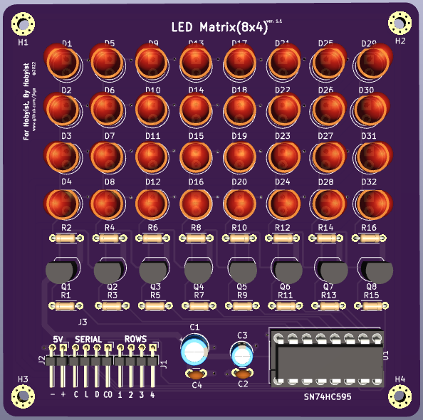

# LED Matrix(8x4) Module
This repository aims to provide a basic program, schematic diagram, and PCB design for  an eight by four (8x4) LED matrix with Arduino and SN74HC595 shift register IC

## Sketch & Pin Configurations
> [Arduino Uno Sketch](./src/led_8x4.ino)

|                     | Module | Arduino 
| ------------------  | ------ | ------- 
| Latch               | L      | 8 
| Serial Data Input   | D      | 11 
| Clock Input         | C      | 12 
| Row 1               | 4      | 4 
| Row 2               | 3      | 5
| Row 3               | 2      | 6
| Row 4               | 1      | 7
| Power (+)           | +      | 5v
| Power (-)           | -      | GND

## Bills of Materials

| QTY       | Reference   | Value 
| --------  | ----------- | --------- 
| 1         | C1          | 33uf        
| 1         | C2          | 0.1uf       
| 1         | C3          | 0.1uf   
| 32        | D1 - D32    | LED (Vfmin = 1.7v; Ifmax = 0.25mA)  
| 1         | J1          | 1x4 Female Connector  
| 1         | J2          | 1x4 Female Connector  
| 1         | J3          | 1x4 Female Connector   
| 1         | J4          | 2x8 DIP Socket  
| 8         | Q1 - Q8     | PN2222A BJT Transistor
| 8         |             | 4.7k ohms
| 8         |             | 510 ohms
| 1         | U1          | SN74HC595N  
| 10        |             | Jumper Wires 

## Demo

## Schematic Diagram

## Printed Circuit Board

## Rendered Model
